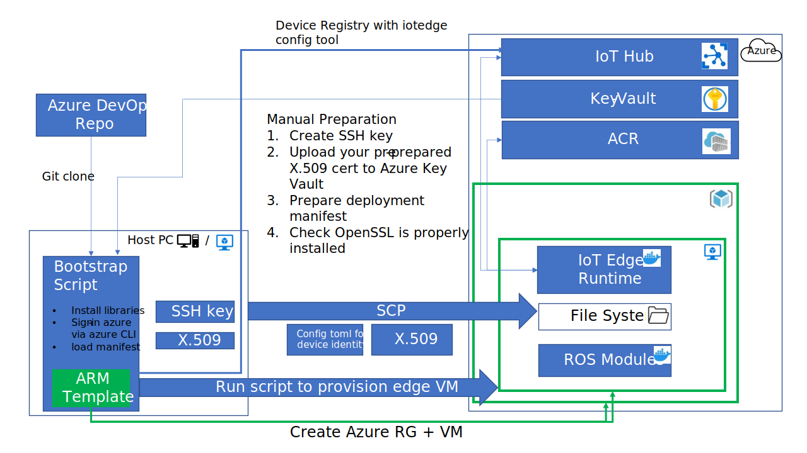

# This repository has been migrated to the [Microsoft](https://github.com/microsoft/mlops-edge-provisioning) organization. This version has been archived, please continue development in the Microsoft organization.
# Edge Device Auto Provisioning

## Overview

The first step in an industrial IoT scenario operation with Azure IoT services is to provision the Edge device to the Azure Cloud IoT platform. In this document, we will describe the pattern to provision the Edge device to Azure IoT Hub in an automated manner with X.509 certificate.

## Applicable Scenarios

Edge device provisioning on Azure IoT platform enables the edge to take full advantages of Azure services for various industrial edge scenarios, including the ML edge inference scenario, robotic control and configuration scenario, and more.

From our prior experiences, we witness the need to automate the process of IoT Edge installation on Edge devices and provisioning these devices to IoT Hub in a reasonable time interval (2~3 minutes).

## Intended Audiences

The intended audiences of this asset are:

- Software Engineer who would like to build up PoC for the potential industry solution with the applicable scenarios.
- DevOps Engineer who would like to execute the edge device provisioning operation.
- Solution Architect who would like to design the IoT/ML solution on Azure platform.

## Solution Overview and Technologies used

This solution uses an Azure Resource Manager (ARM) template to create and configure an Azure VM, prepare configuration files (/provisioning-sample-stg1-create-edge-device/preparation-files) for the Azure VM for the next stage of provisioning.

There are 2 stages involved in the process.

- Stage 1: Prepare the Edge device and configuration files.

- Stage 2: Bootstrap and provision the Edge device to IoT Hub and deploy the IoT Edge modules.

Stage 1 includes the step to create an Azure Virtual Machine(VM) to simulate an Edge device for a proof-of-concept solution, otherwise a physical device could be used directly. Stage 2 bootstraps the Edge device with the configuration files from Stage 1, and provision it to Azure Cloud.

The image below illustrates the stage 2 provisioning architecture.



After cloning and running the repo to the local host PC, the script will install libraries, sign in Azure account, and load the pre-prepared manifest files. Then it will use ARM template to create an Azure VM as an edge device, download the key from Azure Key Vault and SCP transfer the key to the edge VM, register the edge VM to azure IoT Hub with iotedge config tool, and lastly download IoT Edge Runtime modules and custom modules from Azure Container Registry to the edge VM.

## Getting Started 
### Stage 1 - Prepare the Edge device VM and configuration files

Step 1: Prerequisites

- Create an Azure subscription. Try a [free Azure subscription](https://azure.microsoft.com/free/).

- Create an [Azure IoT Hub Instance](https://docs.microsoft.com/azure/iot-edge/quickstart-linux?view=iotedge-2020-11). Understand more on IoT Hub [here](https://azure.microsoft.com/services/iot-hub/#overview).

- Ensure that the host machine that runs the script has a Linux OS and internet access.

Step 2: Secrets and Files Preparation

- Create an SSH key. Use your own ssh key or [create an SSH key](https://docs.microsoft.com/azure/virtual-machines/linux/create-ssh-keys-detailed).

- Prepare an X.509 certificate and [upload to Azure Key Vault](https://docs.microsoft.com/azure/key-vault/certificates/tutorial-import-certificate?tabs=azure-portal).

- Prepare deployment manifest files.

- Make sure OpenSSL is installed in the host machine that runs the scripts for Step 3-1.

Step 3: Create an Edge Device VM 

- Clone the code sample repository to local host machine, and follow README-create-edge-VM.md in the provisioning-sample-stg1-create-edge-device folder.

- The output configuration file will be generated and contains the private IP and FQDN of the created VM, which is the required input for the provisioning process at the next stage.

    ```json
    {
        "edge_private_IP": < edge-device-private-IP >,
        "edge_FQDN": < edge-FQDN >
    }
    ```

Step 4: Check the configuration files

- Check that the folder contents in file folder "./preparation-files" includes the following files.

  - .ssh folder which contains SSH key
  - .env-edge.sh for environment configuration
  - deployment-manifest.json
  - edgeVMfile.json output configuration file generated from Step 3.

  The folder will be used as the input for next stage provisioning.

### Stage 2 - Provision the Edge Device VM to the Cloud

Step 1: Preparation

- Access to the physical device or the Edge Device VM with SSH key from preparation files.

- Clone the code sample repository to local host machine.

- Place "preparation-files" folder into the script root directory.

Step 2: Run Script for Provisioning

- For the details of the script execution, please refer to the README-iot-edge-provision.md in provisioning-sample-stg2-registry-bootstrap folder.

Step 3: Check

- Check the IoT Hub portal for the following items to confirm the edge device is connected successfully:
  - In the IoT Edge Section of the IoT Hub portal, You should see your IoT Edge VM ID is in the device list.
  - The IoT Edge VM in the device list has a Runtime Response "200--OK".
  - reporting a connected status of IoT Edge modules.

## Reference

[Azure IoT Hub](https://learn.microsoft.com/en-us/azure/iot-hub/iot-concepts-and-iot-hub)

[Azure Key Vault basic concepts](https://learn.microsoft.com/en-us/azure/key-vault/general/basic-concepts)

[Azure Container Registry](https://learn.microsoft.com/en-us/azure/container-registry/container-registry-intro)

[Understand the Azure IoT Edge runtime](https://learn.microsoft.com/en-us/azure/iot-edge/iot-edge-runtime?view=iotedge-1.4)

[Azure ARM Templates](https://learn.microsoft.com/en-us/azure/azure-resource-manager/templates/overview)

[iotedge-config tool for auto-provisioning](https://github.com/Azure-Samples/iotedge_config_cli) 